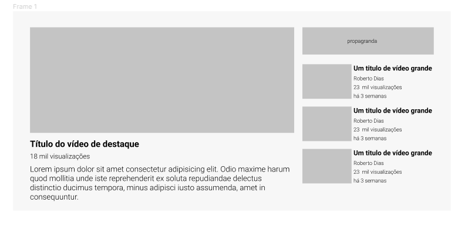

# Layout do Youtube com Grid e Flex
Construção de Layout baseado no desafio de CSS avançado: exercício com Grid do DevQuest. Como é apenas um Layout de 900px de tamanho máximo, não exige responsividade.

## Tecnologias utilizadas
- HTML;
- CSS.

## Layout Esperado: 

## Serviços Usados
- VSCode;
- Google Fonts;
- Site PlaceKitten;
- GitHub;
- GitHub Pges.

## Funcionalidades
Exibição de um layout que imita a tela de reprodução de um vídeo no youtube, com suas propagandas e vídeos sugeridos.

## Links
- GitPages: https://ricardovcastilho.github.io/layout-youtube-com-grid/;
- Link do repositório: https://github.com/RicardoVCastilho/layout-youtube-com-grid.

## Autor
Ricardo Vitor Castilho.